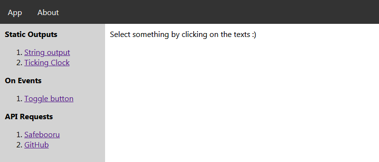

# ReactJS Practice "Playground"

## Intro

yeah, repo name is literally the contents

branches are the "chapters" of learned things

yeah. :)

## Branches are

- [Master][0]: combination of everything in one page
- [0/Hello-World][1]: Just a simple output of a string
- [1/Basic-Functions][2]: functions()
- [2/State-and-Lifecycle][3]: displays a clock where it ticks per second
- [3/Events][4]: button that does something simple
- [4/Ajax][5]: pulls data from [Safebooru][sfbooru] (this is an api that I find simple to use, haha)
- [5/Forms][6]: simple form
- [6/Routers][7]: React Routers things

## Installation... (i think)

- Clone this repository
- `cd` to this repository on node.js cli or git bash
- `npm install`
- `npm start`

## Extra readings

[Github API](https://developer.github.com/v3/search/#search-users)

[ReactJS Forms](https://reactjs.org/docs/forms.html)

[React Routers](https://reacttraining.com/react-router/web/guides/quick-start)

[sfbooru]: https://safebooru.donmai.us

[0]: https://github.com/glnl/self-learn-reactjs-concepts/tree/master
[1]: https://github.com/glnl/self-learn-reactjs-concepts/tree/0/Hello-World
[2]: https://github.com/glnl/self-learn-reactjs-concepts/tree/1/Basic-Functions
[3]: https://github.com/glnl/self-learn-reactjs-concepts/tree/2/State-and-Lifecycle
[4]: https://github.com/glnl/self-learn-reactjs-concepts/tree/3/Events
[5]: https://github.com/glnl/self-learn-reactjs-concepts/tree/4/Ajax
[6]: https://github.com/glnl/self-learn-reactjs-concepts/tree/5/Forms
[7]: https://github.com/glnl/self-learn-reactjs-concepts/tree/6/Routers
